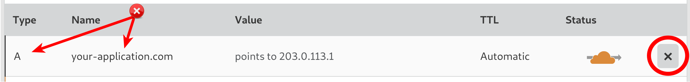
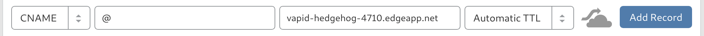

# Cloudflare at a glance

 |   | Does | Doesn't |
 | :---: | :---: | :---: |
 | Apex `CNAME` equivalent | :heavy_check_mark: | |
 | API Access | :heavy_check_mark:| |

 CloudFlare allows you to create a `CNAME` record at the apex domain, however to maintain RFC compliance, Cloudflare performs what they call "[`CNAME` Flattening.](https://support.cloudflare.com/hc/en-us/articles/200169056-Understand-and-configure-CNAME-Flattening)". The net effect is that your users' DNS clients receive an IP address as if the apex domain's resource record was an `A` record, however behind the scenes, Cloudflare is recursively resolving your `CNAME`.

# Using the Apex Domain

1. Log in to your Cloudflare account, select the domain that you want to use with your Fly Edge App, and select "DNS" from the dashboard:

2. Make sure that no `A`, `AAAA`, or `CNAME` records already exist for your apex domain. If they do, delete them:

Otherwise you'll encounter the error _"An A, AAAA, or CNAME record already exists with that host. (Code: 81053)"_

")

3. Create a `CNAME` record for your apex domain using `@` as the name, your Fly Edge App URL as the domain name, and click the "Orange Cloud" icon to become grey:

Once you've saved that record, your domain should be directed to your Fly Edge App!

# Using a Subdomain

If you want your application to use a subdomain on your main domain, you can use the same instructions as above except instead of `@` for the name, use the name that you'd prefer for your subdomain. For example, `app` for your application to use `app.your-application.com` for its URLs.
