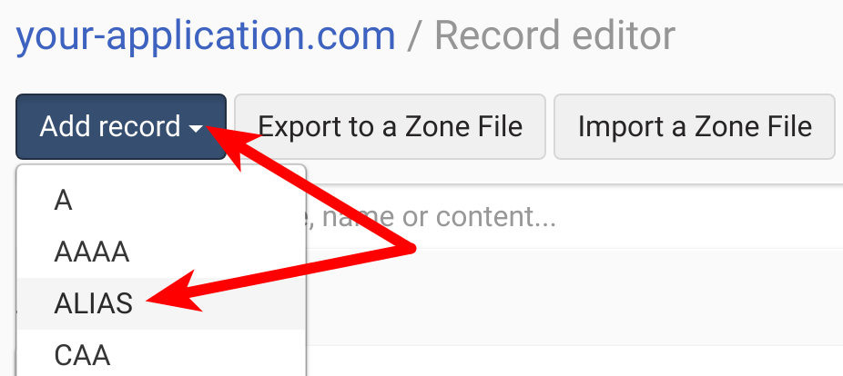

# DNSimple at a Glance

 |   | Does | Doesn't |
 | :---: | :---: | :---: |
 | Apex `CNAME` equivalent | :heavy_check_mark: |  |
 | API Access | :heavy_check_mark:|  |

# Using the Domain Apex

DNSimple has a special, proprietary resource record known as an [`ALIAS` record](https://support.dnsimple.com/articles/alias-record/) that mimics `CNAME` behavior on apex domains. When a DNS client, such as your users' devices, requests your domain name, they're given the value of an `A` record that resolves your domain name to one or more IP addresses. Behind the scenes, DNSimple is actually looking to another hostname to get the IP address that ultimately gets handed back to your users.

## Creating an `ALIAS` record in the DNSimple UI
To create a new `ALIAS` record for your apex domain, log in to your DNSimple account, click in to the domain that you want to manage. From there, follow these steps:

1. Click the "DNS" navigation element, then select "Manage" from the "DNS Records" section:

2. Select "Add record" and choose "`ALIAS`":

3. When adding a new `ALIAS` record for your apex domain, you want to focus on three things. First, leave the name blank if you want to use the apex domain. Second, you need to know the Fly URL for your edge app. For example, `vapid-hedgehog-4710.edgeapp.net`. Third... click the button!

")

4. You've done it! Your apex domain should now point to your Fly Edge App URL, and your application users should be shipped off to Fly's Edge servers every time they access your application. If that's not the case, check out our [troubleshooting document](../troubleshooting.md) or reach out to us at [support@fly.io](mailto:support@fly.io) or [chat with us on Gitter](https://gitter.im/superfly/fly).

## `URL` Records

DNSimple also has support for HTTP redirects with [`URL` Records](https://support.dnsimple.com/articles/url-record/). While handy, we'd recommend that you instead use DNSimple's `ALIAS` record to redirect your application to Fly via DNS, rather than with HTTP redirects. DNSimple `URL` resource records force your clients to move up and down the network stack from DNS to HTTP at DNSimple before then moving to Fly where they once again moving through the network stack to finally reach your application. I would be more performant, and reduce the moving parts to simply use an `ALIAS` record.

However, you know your needs better than we do. If you find that the `URL` record better suits your situation, let us know about it! Drop us a note at [support@fly.io](mailto:support@fly.io) or [chat with us on Gitter](https://gitter.im/superfly/fly).

# Using a Subdomain

If your application lives on a subdomain, you can simply use a `CNAME` record at DNSimple.

1. 
