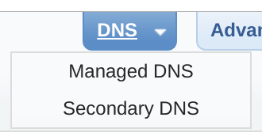
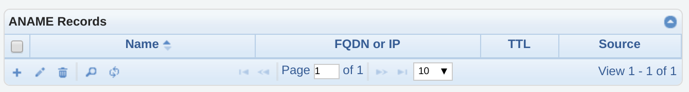
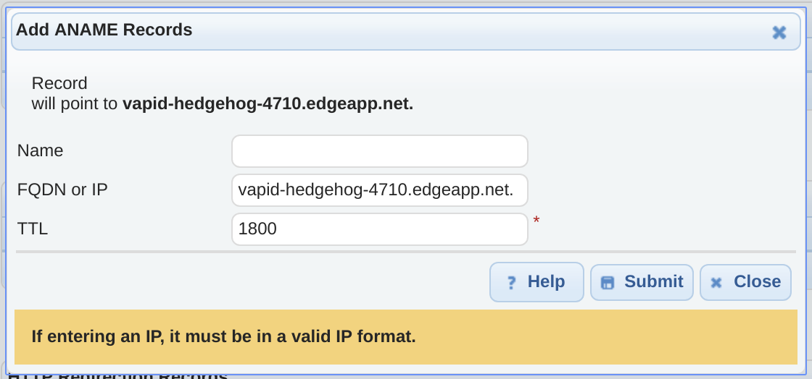
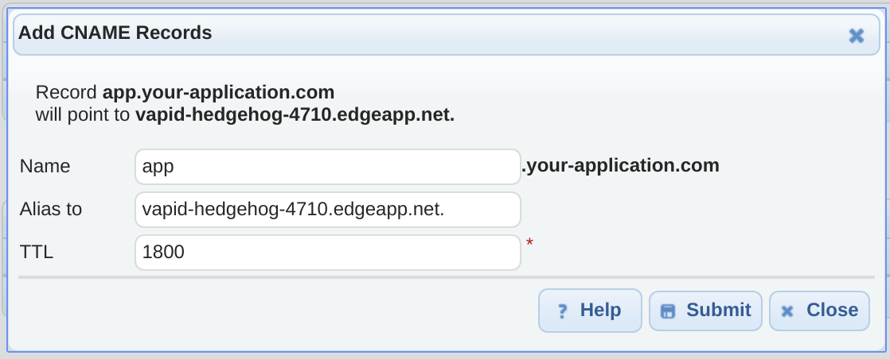

# DNS Made Easy at a glance

 |   | Does | Doesn't |
 | :---: | :---: | :---: |
 | Apex `CNAME` equivalent | :heavy_check_mark: | |
 | API Access | :heavy_check_mark:| |

DNS Made Easy offers a `CNAME`-like record for apex domains [called an `ANAME` record](https://dnsmadeeasy.com/services/anamerecords/).

# Using the Apex Domain

1. Log in to your DNS Made Easy account, view the list of domains that DNS Made Easy manages for you, and select the domain that you want to use with your Fly Edge App.

2. Scroll through the record types associated with your domain name until you find the area to add an `ANAME` record and add one:

3. Create the `ANAME` record with the following information:

- "Name" will be blank to use the apex domain.
- "FQDN or IP" will be the URL of your Fly Edge App URL, _and must end with a period_. For example, `vapid-hedgehog-4710.edgeapp.net.`.
- "TTL" can remain at the default value.

One you save the new `ANAME` record, your users will be able to access your Fly Edge App using your domain name.

# Using a Subdomain

If you want your application to be a subdomain on your main domain, you'll want to create a new `CNAME` record within DNS Made Easy's DNS management dashboard. You can follow steps #1 and #2 above, but in step #2 you'll want to look for the area to add a `CNAME` record. Once you do, click to add one:

You'll need to supply the following information:
- Name: The name of the subdomain you want your users to access your Fly Edge App with. For example: "app" to use "app.your-application.com"
- Alias to: The full domain name of the Fly Edge App that you're creating, _with a trailing period at the end_. For example "vapid-hedgehog-4710.edgeapp.net."
- TTL: You can leave this at the default value.

Once you've supplied all of that information, you can save the record and then you should be able to access your Fly Edge App using your subdomain.