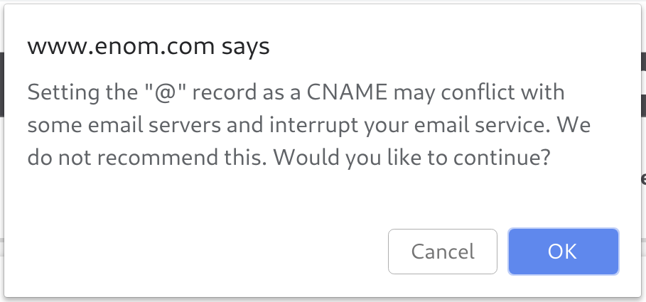
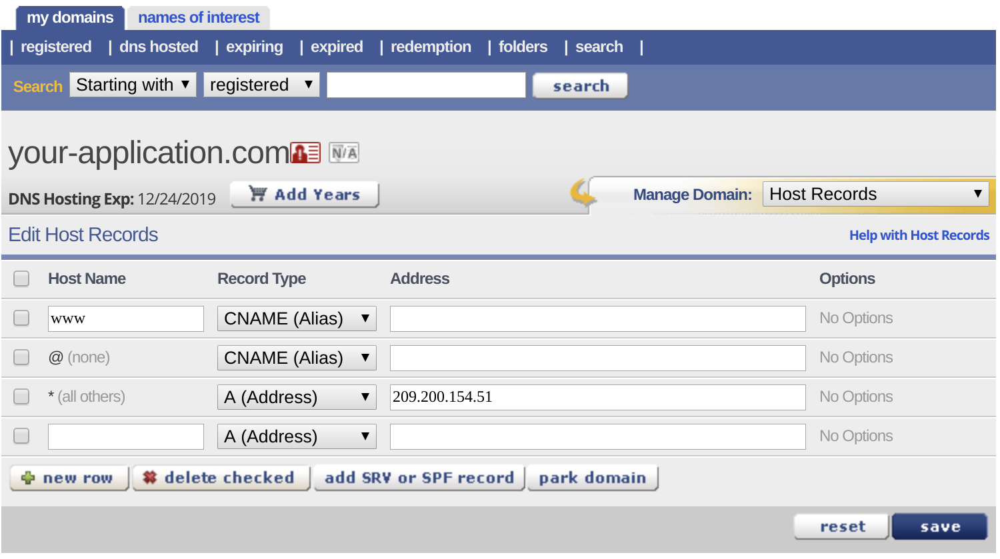
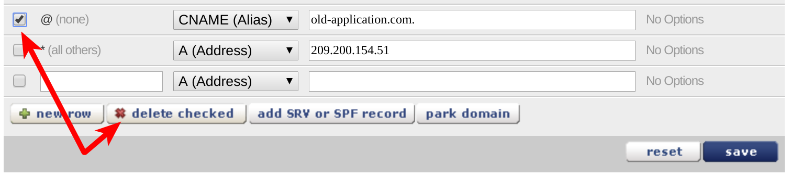
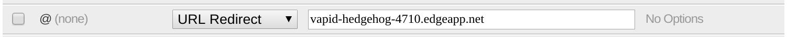
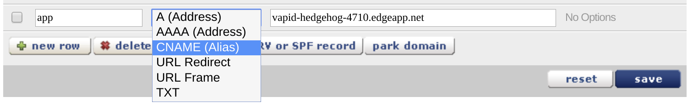

# Enom at a glance

 |   | Does | Doesn't |
 | :---: | :---: | :---: |
 | Apex `CNAME` equivalent |  | :no_entry_sign: |
 | API Access | :heavy_check_mark:| |

While [Enom indicated in the past that they supported apex domain `CNAME` records](https://www.enom.com/blog/our-new-dns-under-the-hood/), this no longer appears to be the case. Currently, wether using Enom's free or premium DNS service, you are warned when attempting to create a `CNAME` record at the apex domain:

[Documentation for DNS records at Enom](https://www.enom.com/help/faq_hostrecords.aspx) also suggest that apex domain `CNAME` records are no longer supported:

> **Restrictions**
>
> * A CNAME must have no other records of other types (MX, A, etc). This is very important especially with the @ record. If you specify a CNAME record type for the @ hostname, then email will not route properly for this domain name.

Enom does provide two types of URL redirect records for apex domains, which you may be able to use if the drawbacks are acceptable to your scenario.

# Using the Apex Domain

At Enom, there are two free URL redirect options that you can utilize for your apex domain: **URL redirects** and **URL frames**. A **URL redirect** causes an HTTP redirect response to be sent to your user's web browser. They are then sent to your Fly Edge App's URL which will be seen in the browser for the duration of the session with your Fly Edge App. A **URL Frame** record loads your fly edge app in an HTML `iframe` element, retaining your apex domain in web browsers. However, that breaks responsive design, among other things. Only you can decide if iframe embedding is acceptable for your use case, however, we'd suggest not using the URL Frame option.

Also note that your users can only click or type your domain URL if it begins with `http://`. If your domain is `your-application.com`, you'll want to give out your URL as `http://your-application.com` rather than `https://your-application.com`. GoDaddy's forwarding servers do not listen for HTTPS requests. However, the URL that you forward to can be `https://`, for example your Fly Edge App's URL.

### Add a URL Redirect or URL Frame Record

1. To redirect your users using a domain at Enom, log in to your Enom account and look for the domain that you want to use with a Fly Edge Application. If Enom is the service being used to host your DNS zone, you'll find the domain under the "DNS hosted" link: 

2. Look for any pre-existing `A`,`AAAA`, `CNAME`, `URL Frame` or `URL Redirect` record with a "Host Name" value of `@` and delete it. Note that by default Enom will create a blank record for `@`. As long as there is no value in the "Address" field of an existing record for `@`, then you can continue.

3. Begin editing the row that Enom creates by default for `@`: 

  * Select either a `URL Redirect` or `URL Frame` record from the "Record Type" drop down menu.
  * The "Address" section would be where your application resides at Fly. For example, `vapid-hedgehog-4710.edgeapp.net`.
  * Save your changes, and rock on with your Fly Edge App!

# Using a Subdomain

If you want your application to be accessed via a subdomain on your main domain, you'll want to create a new `CNAME` record within Enom's DNS management control panel.

1. Log in to your Enom account and look for the domain that you want to use with a Fly Edge Application. If Enom is the service being used to host your DNS zone, you'll find the domain under the "DNS hosted" link:

2. On the DNS Hosting page, click the "New Row" button and create a `CNAME` record.

  * The "Host Name" would be the subdomain that you want your users to access your application with. For example, `app` would mean your users access your site with the URL `app.your-application.com`.
  * The "Record Type" drop down menu needs to be `CNAME`
  * The "Address" section would be where your application resides at Fly. For example, `vapid-hedgehog-4710.edgeapp.net`.

Once you save the `CNAME` information, your users will be able to access your application at Fly.io using the subdomain you just set up. Your users will only see your subdomain in their browser, and will not see your Fly.io URL.