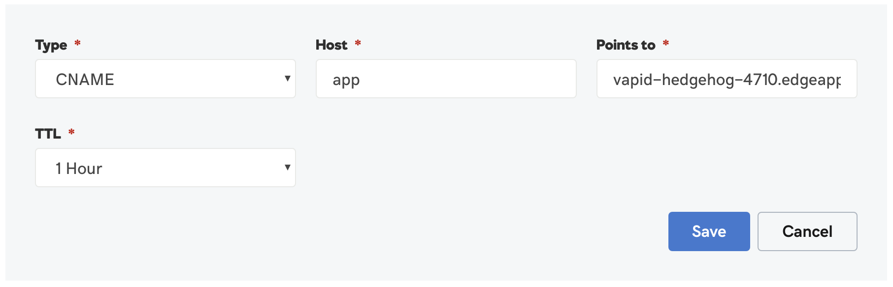

# GoDaddy at a glance

 |   | Does | Doesn't |
 | :---: | :---: | :---: |
 | Apex `CNAME` equivalent | | :no_entry_sign: |
 | API Access | :heavy_check_mark:| |

GoDaddy does not provide a `CNAME`-equivalent resource record for apex domains. Check out our [list of preferred DNS hosts](https://github.com/superfly/dns-help#preferred).

# Using a Subdomain

If you want your application to be a subdomain on your main domain, you'll want to create a new `CNAME` record within GoDaddy's DNS management control panel.

1. Log in to your GoDaddy account and look for the domain that you want to use with a Fly Edge Application. Once you've found it, click the "DNS" button:

2. On the DNS Management page, look for the "Records" section and click the "Add" button:

3. From the "Type" drop down menu, choose to add a `CNAME` record

4. Provide the information to create your `CNAME` record.
  * The "Host" would be the subdomain that you want your users to access your application with. For example, `app` would mean your users access your site with the URL `app.your-application.com`.
  * The "Points to" section would be where your application resides at Fly. For example, `vapid-hedgehog-4710.edgeapp.net`.

Once you save the `CNAME` information, your users will be able to access your application at Fly.io using the subdomain you just set up. Your users will only see your subdomain in their browser, and will not see your Fly.io URL.
