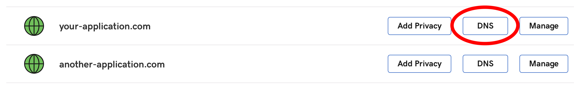
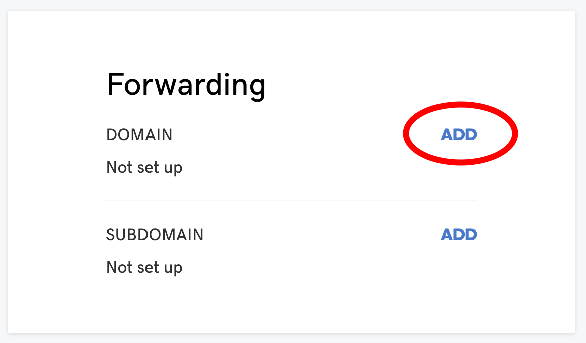
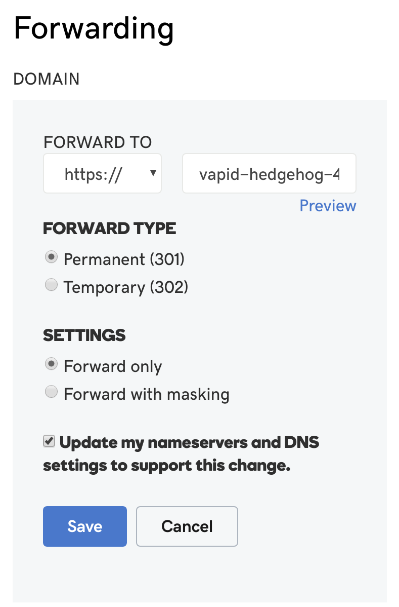
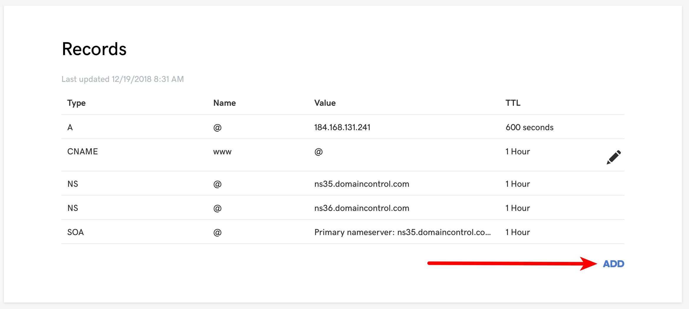
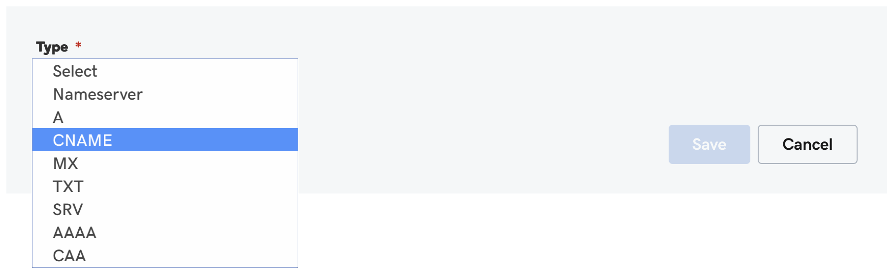

# `Provider Name` at a glance

 |   | Does | Doesn't |
 | :---: | :---: | :---: |
 | Apex `CNAME` equivalent | | :no_entry_sign: |
 | API Access | :heavy_check_mark:| |

GoDaddy does not provide a `CNAME`-equivalent resource record for apex domains. However, GoDaddy does provide free HTTP forwarding or proxying for your domain and its subdomains. Before you proceed, you'll want to assess some downsides.

##  GoDaddy Forwarding

When forwarding a domain that has its DNS zone hosted at GoDaddy, you'll want to consider the following:

* Your users can only click or type your domain URL if it begins with `http://`. If your domain is `your-application.com`, you'll want to give out your URL as `http://your-application.com` rather than `https://your-application.com`. GoDaddy's forwarding servers do not listen for HTTPS requests. However, the URL that you forward to can be `https://`, for example your Fly Edge App's URL.
* Your users will not see your domain in their URL bar. They will ultimately see your Fly.io Edge Application's URL. For example, `https://vapid-hedgehog-4710.edgeapp.net`. This may be an inconsistent and confusing experience.

## GoDaddy "Forwarding with Masking"

When using the "Forwarding with Masking" option for a domain that has its DNS zone hosted at GoDaddy, you're essentially using a proxy server to pull content up to users. There are some downsides to consider:

* You're proxying a proxy of your origin. That is to say, GoDaddy will be proxying your Fly.io Edge Application which is itself a proxy of your origin site. HTTP Headers and HTML title, description, and keywords may be inconsistent.
* The URL that your users access will be delivered over HTTP since GoDaddy doesn't listen for HTTPS requests. This means that the traffic from GoDaddy to your users will be unsecure. Note that the traffic from GoDaddy to your Fly.io Edge Application (e.g. `https://vapid-hedgehog-4710.edgeapp.net`) _will_ be, however the chain of security has been broken.
* The use of GoDaddy's "Forwarding with Masking" feature adds another layer of latency to your application. GoDaddy isn't selling a professional proxy service as much as it's offering a free convenience. As such, performance and reliability may be an unknown variable.

# Using the Apex Domain

These are the steps to use GoDaddy forwarding or forwarding with masking for your apex domain:

1. Log in to your GoDaddy account and look for the domain that you want to use with a Fly Edge Application. Once you've found it, click the "DNS" button:

2. On the DNS Management page, look for the "Forwarding" section. Click "Add" next to the "Domain" sub-section:

3. Modify your forwarding settings:
  * Under "Forward To:" choose "https://" and then type the URL of your Fly.io edge application.
  * [Check GoDaddy's documentation for more information on 301 vs 302 redirects, and forwarding vs masking](https://www.godaddy.com/help/manually-forwarding-or-masking-your-domain-or-subdomain-422). Our suggestion is to use 301 redirects.
  * Choose "Forward Only" or "Forward with Masking" based on your assessment of the cons mentioned above.
  * If you choose "Forward with Masking" you'll need to supply some additional information concerning Site Title, Description, and Keywords.
  * Choose "Update my nameservers and DNS settings to support this change."
  * Save your settings!

You should be all set! It may take a few minutes, but your domain should either redirect to your Fly Edge App URL or proxy your Fly Edge App within a few minutes.

# Using a Subdomain

If your application should be a subdomain on your main domain, you'll want to create a new `CNAME` record within GoDaddy's DNS management control panel.

1. Log in to your GoDaddy account and look for the domain that you want to use with a Fly Edge Application. Once you've found it, click the "DNS" button:

2. On the DNS Management page, look for the "Forwarding" section. Click "Add" next to the "Domain" sub-section:

3. From the drop down menu, choose to add a `CNAME` record

4. Provide the information to create your `CNAME` record.
  * The "Host" would be the subdomain that you want your users to access your application with. For example, `app` would mean your users access your site with the URL `app.your-application.com`.
  * The "Points to" section would be the where your application resides at Fly. For example, `vapid-hedgehog-4710.edgeapp.net`.

Once you save the `CNAME` information, your users will be able to access your application at Fly.io using the subdomain you just set up. Your users will only see your subdomain in their browser, and will not see your Fly.io URL.