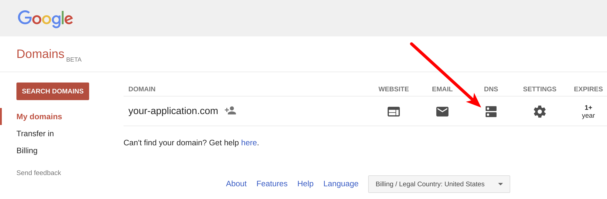
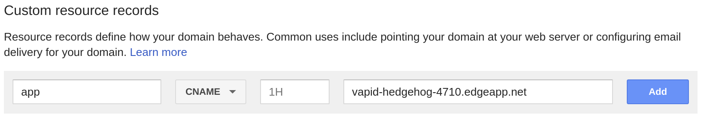
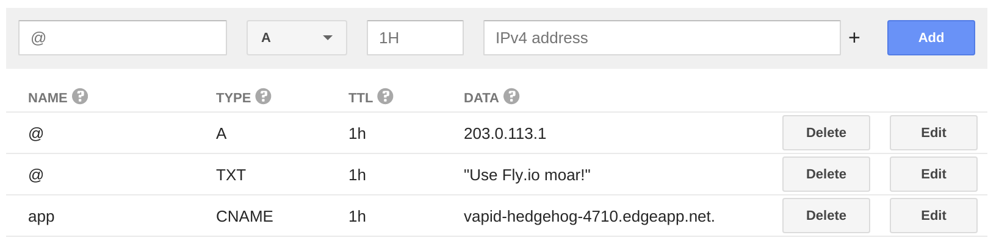

# Google Domains at a glance

 |   | Does | Doesn't |
 | :---: | :---: | :---: |
 | Apex `CNAME` equivalent |  | :no_entry_sign: |
 | API Access | | :no_entry_sign: |

 Google Domains does not offer an API to interact with DNS records.

# Using the Apex Domain

Google Domains does not have an apex domain `CNAME`-equivalent resource record. Take a look at our [list of preferred DNS hosts](https://github.com/superfly/dns-help#preferred).

# Using a Subdomain

If you want your application to be a subdomain on your main domain, you'll want to create a new `CNAME` record within Google Domains's DNS management GUI.

1. Log in to your Google Domains account at https://domains.google.com/ and select the "DNS" icon in the row for the domain that you want to use with your Fly Edge App.

2. Scroll down to find the "Custom resource records" section. Provide the following information in the provided fields and then click "Add" to create a new resource record:

- **Name:** The name of the subdomain that you want your users to access your Fly Edge App with. For example "app" to access your application with `app.your-application.com`.
- **Type:** Select `CNAME`
- **TTL:** You can keep the default value.
- **Data:** This would be the domain name of your Fly Edge App. For example, `vapid-hedgehog-4710.edgeapp.net`

3. You should now have a new `CNAME` record among your other DNS records:

Your subdomain should now be sending traffic to your Fly Edge App!
