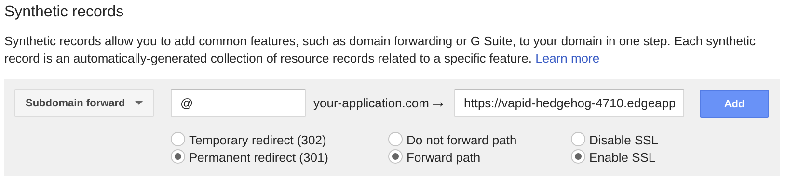
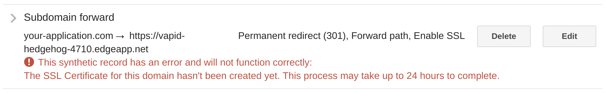

# Google Domains at a glance

 |   | Does | Doesn't |
 | :---: | :---: | :---: |
 | Apex `CNAME` equivalent |  | :no_entry_sign: |
 | API Access | | :no_entry_sign: |

 Note that Google Domains is different from the [Google Cloud Platform's Cloud DNS](./google-cloud.md) offering.

 Google Domains does not offer an API to interact with DNS records.

# Using the Apex Domain

 Google Domains does not have an apex domain `CNAME`-equivalent resource record, however there is an ability to create an HTTP forwarding record at the apex domain. This will forward HTTP traffic to your Fly Edge App, but will not retain your domain name in a browser URL bar. If you use Google Domains as your DNS host, there is no means of retaining your apex domain in a browser URL bar while using a Fly Edge App. You can, however, mask your Fly Edge App URL if you use a subdomain.
 
 Google Domains supports HTTPS forwarding by creating a Let's Encrypt certificate for your domain and installing it on their infrastructure. This can take up to 24 hours, but the final result will be that your users can use links to your domain over both HTTP and HTTPS and be forwarded to your Fly Edge App (which is also served over HTTPS).

 1. Log in to your Google Domains account at https://domains.google.com/ and select the "DNS" icon in the row for the domain that you want to use with your Fly Edge App.

 
 
 2. Scroll down to find the "Synthetic records" section. Create a new synthetic record using the following information:

  - Choose "Subdomain forward" from the drop down box.
  - In the "Subdomain" input field, type a single `@` symbol.
  - For the "Destination URL", put your Fly Edge App URL. E.g. `https://vapid-hedgehog-4710.edgeapp.net`
  - Choose appropriate [redirect options](https://support.google.com/domains/answer/4522141#moreoptions) for your use case. The most common option to choose is "Enable SSL"

3. You may need to wait up to 24 hours for your certificate to be created, however it often only takes a few minutes:

Assuming you chose "Enable SSL", your domain should now be forwarding both HTTP and HTTPS requests to your Fly Edge App!

# Using a Subdomain

If you want your application to be a subdomain on your main domain, you'll want to create a new `CNAME` record within Google Domains's DNS management GUI.

1. Log in to your Google Domains account at https://domains.google.com/ and select the "DNS" icon in the row for the domain that you want to use with your Fly Edge App.

2. Scroll down to find the "Custom resource records" section. Provide the following information in the provided fields and then click "Add" to create a new resource record:

- **Name:** The name of the subdomain that you want your users to access your Fly Edge App with. For example "app" to access your application with `app.your-application.com`.
- **Type:** Select `CNAME`
- **TTL:** You can keep the default value.
- **Data:** This would be the domain name of your Fly Edge App. For example, `vapid-hedgehog-4710.edgeapp.net`

3. You should now have a new `CNAME` record among your other DNS records:

Your subdomain should now be sending traffic to your Fly Edge App!