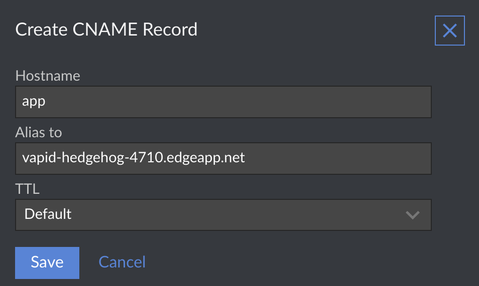

# Linode at a glance

 |   | Does | Doesn't |
 | :---: | :---: | :---: |
 | Apex `CNAME` equivalent | | :no_entry_sign: |
 | API Access | :heavy_check_mark:| |

Linode does not provide a `CNAME`-equivalent resource record for apex domains. 

# Using a Subdomain

If you want your application to be a subdomain on your main domain, you'll want to create a new `CNAME` record within Linode's dashboard.

1. Log in to your Linode account, select "Domains" from the side navigation, and then click on the domain that you want to use with a Fly Edge Application.

2. On the DNS Management page for your domain, look for the "CNAME Record" section and click on the "Add a CNAME Record" button.

3. Provide the information to create your `CNAME` record.
  * The "Hostname" would be the subdomain that you want your users to access your application with. For example, `app` would mean your users access your site with the URL `app.your-application.com`.
  * The "Alias to" section would be where your application resides at Fly. For example, `vapid-hedgehog-4710.edgeapp.net`.

Once you save the `CNAME` information, your users will be able to access your application at Fly.io using the subdomain you just set up. Your users will only see your subdomain in their browser, and will not see your Fly.io URL.
