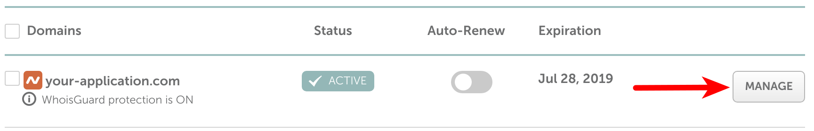
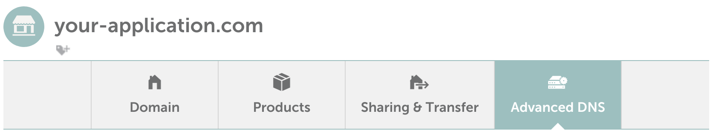
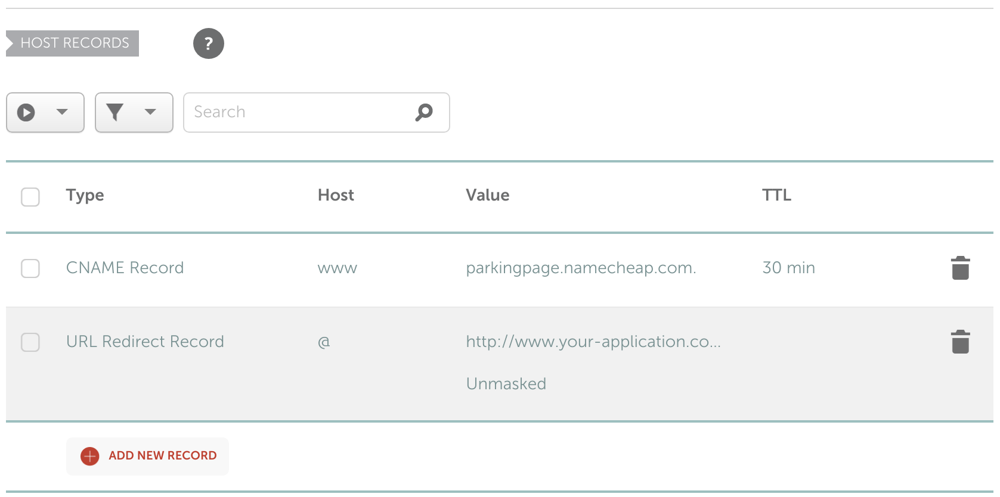
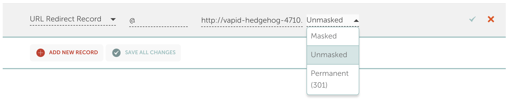
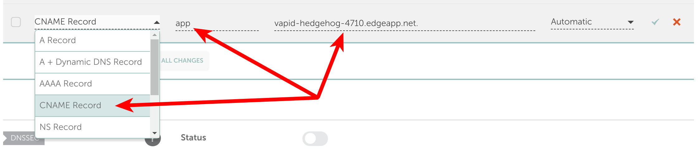

# Namecheap  at a glance

 |   | Does | Doesn't |
 | :---: | :---: | :---: |
 | Apex `CNAME` equivalent |  | :no_entry_sign: |
 | API Access | :heavy_check_mark:|  |

 For the purposes of this document, Namecheap offers two main DNS options for their customers: FreeDNS and PremiumDNS. Neither product offers a `CNAME`-equivalent resource record for the apex domain. It's _technically_ possible at Namecheap for you to add a pure `CNAME` record at the apex domain, however since that is against the RFC standard, the behavior will be unpredictable. We do not recommend using Namecheap's ability to place a pure `CNAME` record at your apex domain. You will almost certainly have negative consequences as a result.

 Instead, you can use their URL forwarding option.

# Using the Apex Domain

To use the apex domain, you'll want to use Namecheap's free URL forwarding service. However, you'll want to consider the following limitations and characteristics of URL forwarding:

* Your users can only click or type your domain URL if it begins with `http://`. Namecheap's forwarding servers do not listen for HTTPS requests.  If your domain is `your-application.com`, you'll want to give out your URL as `http://your-application.com` rather than `https://your-application.com`. However, the URL that you forward to can be `https://`, for example your Fly Edge App's URL.
* Using the "masking" option for a URL forwarding record will allow your users to see your domain in their browser's URL bar. However, your Fly Edge App will be loaded in an iframe, breaking responsive design, among other things. Only you can decide if iframe embedding is acceptable for your use case.
* Disabling the "masking" option for Namecheap URL forwarding will cause users to be HTTP redirected to your Fly Edge App URL. This means they'll see your Fly URL in their browser for the duraion of their time with your application. For example, `https://vapid-hedgehog-4710.edgeapp.net`. This may be an inconsistent and confusing experience.

Follow these steps to create an URL forwarding record:

### 1. Log in to Namecheap, search for the domain that you'd like to use with your Fly Edge App, and click "manage."

### 2. On the "Domain" overview page, check to make sure that either BasicDNS, FreeDNS, or PremiumDNS is the selected option.

URL forwarding only works if your domain is using Namecheap's nameservers. 

### 3. Click "Advanced DNS"

This is where you'll modify your domain's DNS resource records.

### 4. Remove any pre-existing records that you have previously created at the apex domain, if they exist.

If you have a record at `@` that points to `http://www.your-application.com/?from=@`, you can ignore it and proceed to the next step. Namecheap will, by default, place a record at `@`and `www` if you have no user-created records, so you will never have a totally empty zone. Namecheap's default `@` record will redirect you to the `www` subdomain, and ultimately result in their `parkingpage.namecheap.com` URL. The following screenshot shows a domain that has Namecheap's records which you can ignore and move on to step 5:

If you have a record at `@` that points anywhere else than `http://www.your-application.com/?from=@`, then you'll want to remove it before proceeding.

### 5 Add a new "URL Redirect Record" for your apex domain.

Add a new record, choosing "URL Redirect Record" as the type, `@` as the host, and your Fly Edge App URL as the Destination URL. You'll then need to choose the redirect type. [You can find out more detailed information about the redirect types that Namecheap offers here](https://www.namecheap.com/support/knowledgebase/article.aspx/9604/2237/types-of-domain-redirects--301-302-url-redirects-url-frame-and-cname). This is a brief summary of your choices:

 - Masked: This loads the destination site in an iframe and keeps your apex domain in a user's browser.
 - Unmasked: This uses an HTTP 302 Redirect to send traffic to the destination URL.
 - Permanent: This uses an HTTP 301 Redirect to send traffic to the destination URL.

 For both Unmasked and Permanent options, your users will see the destination URL (your Fly Edge App) in their browser, rather than your own domain.

 Once you've chosen the redirect type, click the green check mark.

Your domain should now be usable with your Fly Edge App.

# Using a Subdomain

If you want your application to be a subdomain on your main domain, you'll want to create a new `CNAME` record within Namecheap's DNS management dashboard.

### 1. Log in to Namecheap, search for the domain that you'd like to use with your Fly Edge App, and click "manage."

### 2. Click "Advanced DNS"

###  3. Add a new resource record, choosing `CNAME` as the type:

  * The "Host" value would be the subdomain that you want your users to access your application with. For example, `app` would mean your users access your site with the URL `app.your-application.com`.
  * The "Points to" section would be where your application resides at Fly. For example, `vapid-hedgehog-4710.edgeapp.net`.

Once you save the `CNAME` information, your users will be able to access your application at Fly.io using the subdomain you just set up. Your users will only see your subdomain URL in their browser, and will not see your Fly.io URL.