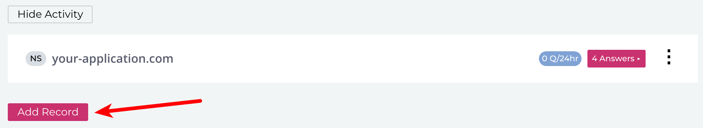
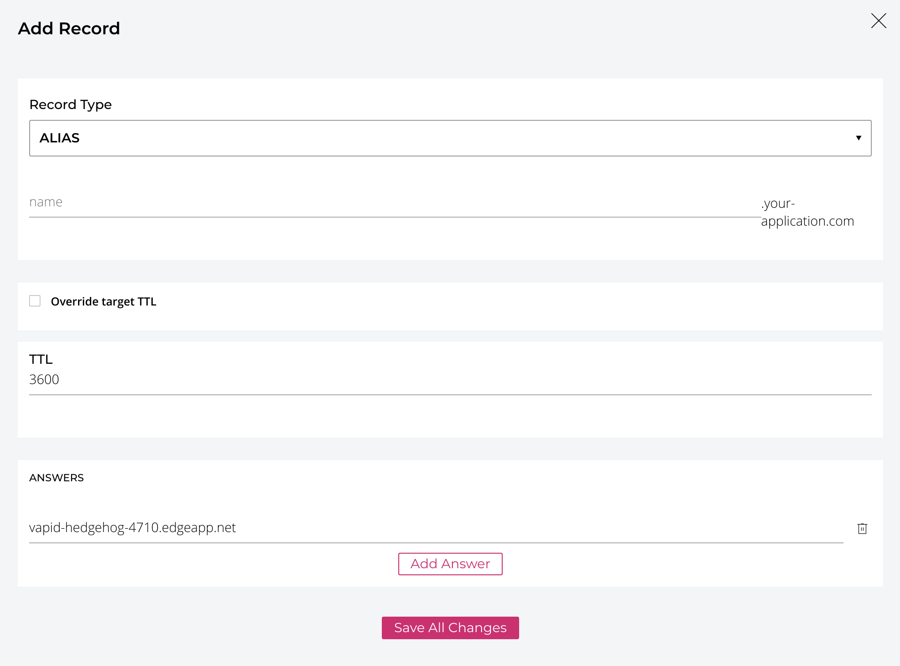

# NS1 at a glance

 |   | Does | Doesn't |
 | :---: | :---: | :---: |
 | Apex `CNAME` equivalent | :heavy_check_mark: | |
 | API Access | :heavy_check_mark:| |

 NS1 allows you to create a `CNAME`-like record at the apex domain using an `ALIAS` record. You can read more about the proprietary record type they've developed here: https://ns1.com/knowledgebase/comparing-alias-and-cname-records

# Using the Apex Domain

1. Log in to your NS1 account, click on the domain that you want to use with your Fly Edge App, and select "Add Record" to add a DNS record to your zone.

2. Select `ALIAS` as the record type. Type in your Fly Edge App hostname in the "Answers" section. You may leave all other inputs with their default values unless you have specific reason to change them. Click "Save All Changes."

Once you've saved that record, your domain should be directed to your Fly Edge App!

# Using a Subdomain

If you want your application to use a subdomain on your main domain, you can use the same instructions as above except instead of choosing the `ALIAS` record type, choose a `CNAME` record type. In the "name" section, you'll place the name for your subdomain. For example, `app` if you want your application to use `app.your-application.com` for its URLs.
