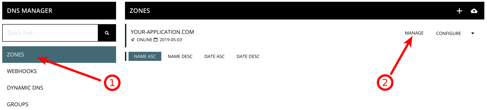
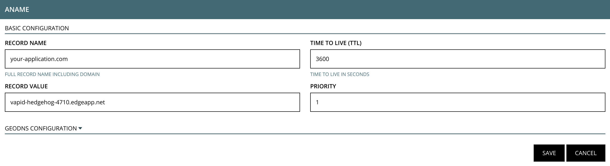

# Rage4 at a glance

 |   | Does | Doesn't |
 | :---: | :---: | :---: |
 | Apex `CNAME` equivalent | :heavy_check_mark: | |
 | API Access | :heavy_check_mark:| |

Rage4 allows you to create a `CNAME`-like record at the apex domain using an `ANAME` record.

# Using the Apex Domain

1. Log in to your Rage4 account, click the "Zones" link on the sidebar navigation, find the zone that you'd like to use with your Fly Edge App, and then click "manage."

2. Scroll through the available records types and find the `ANAME` section. Click "New Record." Type in your Fly Edge App hostname in the "Record Value" section. You may leave all other inputs with their default values unless you have specific reason to change them. Click "Save."

Once you've saved that record, your domain should be directed to your Fly Edge App!

# Using a Subdomain

If you want your application to use a subdomain on your main domain, you can use the same instructions as above except instead of choosing the `ANAME` record type, choose a `CNAME` record type. In the "Record Name" section, you'll place the name for your subdomain _*including*_ your domain. For example, type `app.your-application.com` if you want `app` as your subdomain, thus your application and users will use `app.your-application.com` for URLs.
